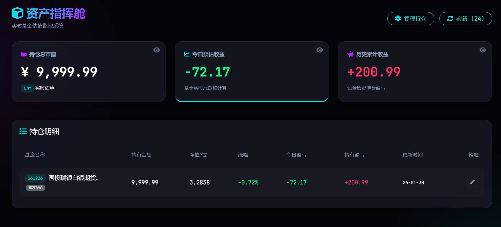

# 📈 FundMonitor - 基金实时监控资产指挥舱

一个基于 Python Flask 和 jQuery 开发的基金实时估值监控系统。采用“资产指挥舱”风格设计，提供极具科技感的 UI 界面，帮助投资者实时掌控个人持仓波动。

---

## ✨ 项目亮点 (Features)

-   **🚀 实时估值**：自动对接 API 接口，实时获取基金最新净值估算。
-   **🖥️ 科技感 UI**：仿“监控中心”布局，支持动态数据刷新与深色模式视觉特效。
-   **🔐 访问控制**：内置身份验证机制，通过 Basic Auth 保护个人财务隐私。
-   **📊 自动计算**：自动汇总计算当日收益、持仓占比及累计盈亏。
-   **📱 响应式设计**：完美适配 PC 端与移动端浏览器。

## 📸 界面预览 (Screenshots)




## 🛠️ 技术栈 (Tech Stack)

-   **后端 (Backend)**: Python 3.x, Flask
-   **前端 (Frontend)**: HTML5, CSS3 (Flexbox/Grid), jQuery
-   **图标/组件**: Font Awesome, Google Fonts
-   **数据格式**: JSON

## 🚀 快速开始 (Quick Start)

### 1. 克隆项目
```bash
      git clone [https://github.com/MIX-LJ/FundMonitor.git](https://github.com/你的用户名/FundMonitor.git)
cd FundMonitor
```

### 2. 安装配置
```bash
    pip install -r requirements.txt
```

### 3. 配置数据
在项目根目录下配置 funds.json 文件，填入你的持仓信息：
```bash
    JSON
    [
        {
            "code": "000001",
            "name": "示例基金",
            "cost": 1.2345, 
            "shares": 1000.0
        }
    ]

```
### 4. 运行项目
```bash
  python app.py
  默认访问地址：http://127.0.0.1:5000
```


### ⚙️ 环境变量与安全
登录账号: 请在 app.py 的 check_auth 函数中修改默认的用户名和密码。


### 📄 开源协议 (License)
本项目采用 MIT License 协议。

### 👨‍💻 作者 (Author)
GitHub: @MIX-LJ